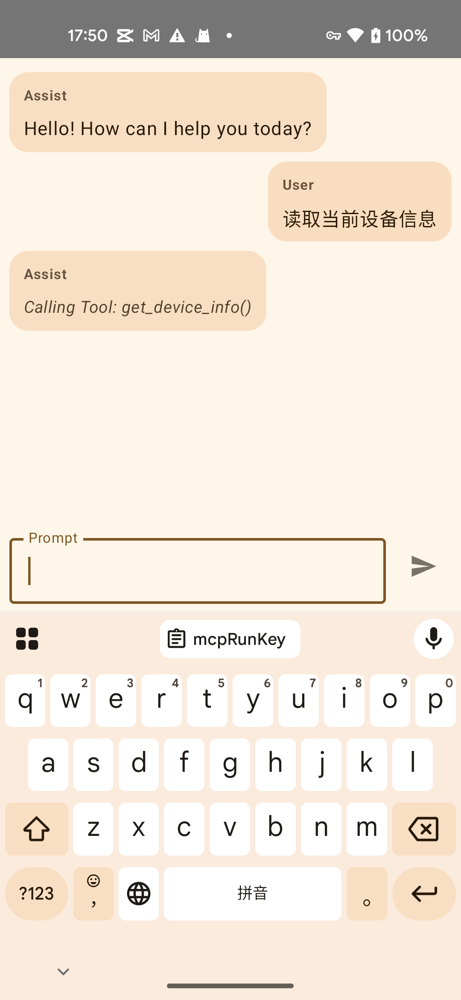

# MCPx4Android

This is an Android project that demonstrates the use of the Model Context Protocol (MCP) for AI-assisted ChatBot.

## Overview

The project provides a chat interface where users can interact with an AI assistant to get help with some tasks. The AI assistant can call tools to fetch information and provide relevant suggestions.

## Key Features

*   Chat interface with user and AI assistant message bubbles.
*   Real-time display of AI assistant tool calls.
*   Loading and error states for AI assistant responses.
*   MCP integration for tool execution.

## Architecture

The project follows a Model-View-ViewModel (MVVM) architecture.

*   **View**: `MainChatScreen.kt` - Implements the UI using Jetpack Compose.
*   **ViewModel**: `MainChatViewModel.kt` - Manages the UI state and interacts with the model.
*   **Model**: `ChatSession.kt` - Handles the AI assistant and tool execution logic.

## MCP Servers

The project uses the following MCP servers:

*   `DeviceInfoMcpServer` - Provides device information to the AI assistant.

## MCP Tools

* `get_device_info` - Fetches device information from the MCP server.
* `fetch` - Fetches information from web based on user's input.

## Dependencies

*   Jetpack Compose
*   Kotlin Coroutines
*   MCP4J
*   MCP Kotlin SDK
*   Gson

## Getting Started

1.  Clone the repository.
2.  Open the project in Android Studio.
3.  Build and run the project on an Android device or emulator.
4.  run this command in your computer: npx --yes -p @dylibso/mcpx@latest gen-session
5.  get the `Session` to mcpRunKey in local.properties file.

## License

[MIT](LICENSE)
